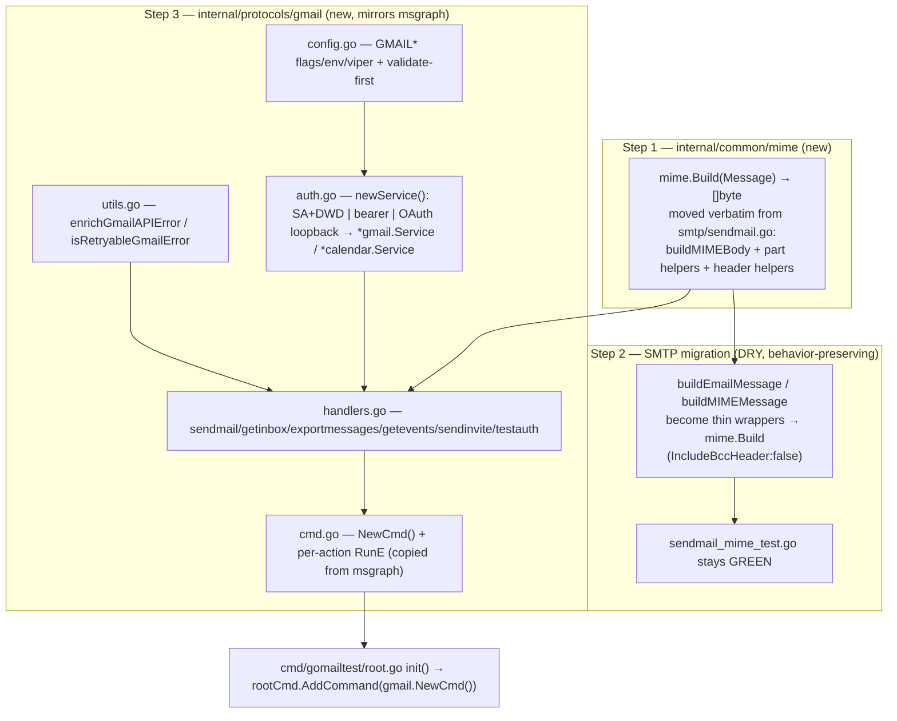

# Add a Google Workspace / Gmail provider to gomailtest

## Context

`gomailtest` is a multi-protocol mail test CLI. It already speaks SMTP, IMAP, POP3, JMAP,
EWS and **Microsoft Graph** (Exchange Online), but has no first-class Google/Gmail provider —
Gmail can only be reached today through the generic IMAP/SMTP paths.

This adds a `gmail` provider that reaches Gmail/Workspace programmatically the enterprise way:
a **service account with domain-wide delegation (DWD)** impersonating a Workspace user via the
Gmail/Calendar APIs. It is structured to mirror `internal/protocols/msgraph/` exactly, so it
reuses the shared `internal/common/*` machinery and matches project conventions.

**Outcome:** `gomailtest gmail <action> …` for send/read/export mail and basic calendar ops,
authenticated by service-account DWD (primary), a pre-obtained bearer token, or an interactive
OAuth loopback flow.

Decisions are locked (confirmed with the user): command/env prefix `gmail`/`GMAIL*`; scope =
mail **and** calendar; all three auth methods; and MIME assembly extracted into a shared
package with SMTP migrated onto it.

## Verified against the code

- msgraph structure confirmed: `cmd.go` (`NewCmd` + per-action `newXxxCmd`), `config.go`
  (`Config`, `NewConfig`, `RegisterPersistentFlags`, `BindEnvs`, `ConfigFromViper`,
  `validateConfiguration`, action consts, `stringSlice`), `auth.go`, `handlers.go`,
  `utils.go`, `config_test.go`. `cert_*.go` are Windows-only and **not needed**.
- RunE lifecycle to copy verbatim: `msgraph/cmd.go:56-93` (getevents) is the cleanest template
  — `BindPFlags(Flags)+BindPFlags(InheritedFlags) → bootstrap.LoadConfigFile → ConfigFromViper →
  set Action → validateConfiguration → SetupSignalContext → InitLoggers → set proxy env →
  build client → call handler`.
- MIME helpers to extract live in `internal/protocols/smtp/sendmail.go`: `buildMIMEBody`
  (:418), `textOrAlternativePart` (:434), `wrapRelatedPart` (:473), `wrapMixedPart` (:505),
  `writeAttachmentPart` (:537), `writeBase64` (:559), `sanitizeEmailHeader` (:578),
  `priorityHeaderLines` (:587), `sanitizeEmailHeaders` (:609), `generateMessageID` (:618).
- Reusable commons confirmed: `email.Attachment`/`email.Header`/`email.ParseHeaders`/
  `email.LoadAttachments`/`email.LoadInlineAttachments`; `export.CreateExportDir`/
  `export.SanitizeFilename`; `security.MaskEmail`/`security.MaskAccessToken`;
  `retry.RetryWithBackoffFunc(ctx, max, delay, op, classify)` with a `Classifier` type;
  `validation.Validate{Email,Emails,FilePath}`.
- `golang.org/x/oauth2 v0.35.0` is already an **indirect** dep (promote to direct).
- Registration point: `cmd/gomailtest/root.go:34-45` `init()` block.
- Existing MIME behavior is guarded by `internal/protocols/smtp/sendmail_mime_test.go`
  (13 tests incl. `TestBuildMIMEMessage_NoExtrasFallsBackToPlainText`, Cc/Bcc header presence,
  priority headers, alternative/inline/attachment/custom-header cases).

## Shape of the change



## Step 1 — Shared MIME builder (`internal/common/mime`)

Create `internal/common/mime/mime.go`. **Move** (cut, don't reimplement) the helpers listed
above from `smtp/sendmail.go`. Public API, consuming `common/email` types:

```go
type Message struct {
    From, Subject      string
    To, Cc, Bcc        []string
    TextBody, HTMLBody string
    Priority           string          // high|normal|low
    Headers            []email.Header
    Attachments, Inline []email.Attachment
    IncludeBccHeader   bool            // SMTP=false (envelope), Gmail=true
    HostID             string          // Message-ID host; "" → "smtptool" (preserves current default)
}
func Build(m Message) ([]byte, error) // full RFC 5322 message, CRLF, base64 parts
```

**Byte-for-byte preservation is the correctness bar** (this is what the SMTP tests check):
- `Build` must reproduce BOTH existing branches. When there are no extras (no HTML, no
  attachments, no inline, no custom headers) it must emit the exact simple layout of
  `buildEmailMessage` (`sendmail.go:314-340`) — including its **trailing `\r\n` after the
  body** and `Content-Type: text/plain; charset=UTF-8`. Otherwise emit the multipart layout
  of `buildMIMEMessage` (`sendmail.go:346-405`) — which has **no** trailing CRLF.
- `IncludeBccHeader` gates whether a `Bcc:` header line is written (new; the old SMTP code
  never wrote one). SMTP passes `false`, so its output is unchanged.
- Keep `generateMessageID`'s `host==""` → `"smtptool"` fallback via `HostID`.

Add `internal/common/mime/mime_test.go` (table-driven): plain, html-only, text+html
alternative, inline, mixed attachment, custom headers, priority high/low/normal, and
`IncludeBccHeader` true-vs-false.

## Step 2 — SMTP migration

In `smtp/sendmail.go`:
- Replace the bodies of `buildEmailMessage` and `buildMIMEMessage` so they build a
  `mime.Message` (with `IncludeBccHeader:false`, `HostID:""`) and delegate to `mime.Build`.
  `buildMIMEMessage` keeps loading attachments via `email.LoadAttachments`/`LoadInlineAttachments`
  and parsing headers via `email.ParseHeaders` (unchanged), then passes them into the struct.
- Delete the now-moved helper funcs from `sendmail.go`; keep SMTP-only `collectEnvelopeRecipients`.
- Update imports (drop `mime/multipart`, `net/textproto`, `encoding/base64` if now unused).
- **Verify:** `go test ./internal/protocols/smtp/...` stays green with no test edits. If a test
  references a moved unexported symbol (e.g. `priorityHeaderLines`), re-point it at
  `mime.PriorityHeaderLines` or keep a thin re-export in smtp — prefer the former.

## Step 3 — The `gmail` package (`internal/protocols/gmail/`)

Libraries: `google.golang.org/api/gmail/v1`, `google.golang.org/api/calendar/v3`,
`google.golang.org/api/option`, `google.golang.org/api/googleapi`, `golang.org/x/oauth2`,
`golang.org/x/oauth2/google`. Pure-Go, cross-compiles cleanly (no cgo, no Windows-cert-store
constraint → no `cert_*.go`).

### `config.go`
`Config` mirroring msgraph but Google-shaped. Fields: `CredentialsFile` (SA JSON),
`BearerToken`, `UseOAuth bool`, `OAuthCredentials`, `TokenCache`, `Scopes []string`,
`Mailbox` (impersonated subject / calendar id), the shared content fields (To/Cc/Bcc/Subject/
Body/BodyHTML/BodyTemplate/Attachment*/Headers/Priority), `StartTime`/`EndTime`, `MessageID`/
`Subject`(search)/`ExportDir`, `Count`, and network/output fields. Reuse msgraph's `stringSlice`
and `parseStringSlice` (copy into package).

Action constants: `getevents, sendmail, sendinvite, getinbox, exportmessages, getevents,
testauth, exportbearertoken`. Flags/env prefix `GMAIL*`; `RegisterPersistentFlags`, `BindEnvs`,
`ConfigFromViper` follow msgraph 1:1. Content/calendar/search flags per-subcommand match
msgraph `cmd.go:156-166,225-226,467-470`. New auth flags: `--credentials`, `--bearertoken`,
`--oauth`, `--oauth-credentials`, `--token-cache`, `--scope`; target `--mailbox`.

`validateConfiguration` (validate-first, mirrors `msgraph/config.go:291`):
- Exactly one auth method among {`--credentials`, `--bearertoken`, `--oauth`}; error otherwise.
- File paths (`--credentials`/`--oauth-credentials`/`--token-cache` when set) via
  `validation.ValidateFilePath`.
- `--mailbox` a valid email (via `validation.ValidateEmail`) — **required for SA-DWD and OAuth**
  because it is the DWD `Subject`; not required for bearer-token-only calls that use `me` only if
  a mailbox is still needed for calendar id (require it for calendar actions regardless).
- Recipients/attachments/headers/priority/RFC3339 times via `common/validation` +
  `email.ParseHeaders` + the flexible-time check (reuse `parseFlexibleTime`).
- Per-action: `sendmail` defaults To→mailbox when no recipients (msgraph `cmd.go:149-151`);
  `exportmessages` needs `--messageid` and/or `--subject`; `sendinvite` needs `--start`/`--end`.
- **Injection guard:** copy msgraph's `validateMessageID` and `validateSearchSubject`
  (`utils.go:84,123`) and run them before building the Gmail query, to block search-operator
  injection.

Separate `validateExportBearerTokenConfiguration` like msgraph (`config.go:417`).

### `auth.go`
`newService(ctx, config) ([]option.ClientOption, error)` returning a token-source option, then
callers do `gmail.NewService(ctx, opts...)` / `calendar.NewService(ctx, opts...)`. Exactly one of:

1. **SA + DWD (primary):**
   ```go
   key, _ := os.ReadFile(config.CredentialsFile)
   conf, _ := google.JWTConfigFromJSON(key, effectiveScopes(config)...)
   conf.Subject = config.Mailbox            // MANDATORY — impersonated user
   opt := option.WithTokenSource(conf.TokenSource(ctx))
   ```
   Call out the mandatory `Subject` in validation + docs (without it the SA authenticates as
   itself and every call fails).
2. **Bearer token:** `option.WithTokenSource(oauth2.StaticTokenSource(&oauth2.Token{AccessToken: config.BearerToken}))`.
3. **Interactive OAuth:** `google.ConfigFromJSON(oauthClientJSON, scopes...)` → loopback flow
   (bind `127.0.0.1:0` listener, open browser to `AuthCodeURL`, capture `code`, `Exchange`),
   cache token JSON at `--token-cache` (default under `os.UserConfigDir()/gomailtest/gmail-token.json`)
   and reuse via `conf.TokenSource(ctx, cachedToken)` on later runs.

`effectiveScopes(config)`: return `--scope` if set, else per-action default (must be a subset of
the Admin-Console DWD authorization or Google returns `unauthorized_client`):
- send → `gmail.send`; inbox/export → `gmail.readonly`; calendar read → `calendar.readonly`;
  calendar write → `calendar.events`.

`exportbearertoken`: acquire a token from the chosen credential's token source and print it
(text, or `{"bearertoken":"…"}` in json) — mirror `msgraph/cmd.go:474`.

### `handlers.go` — Gmail is NOT Graph
- **sendmail:** build via `mime.Build(mime.Message{…, IncludeBccHeader:true})`, then
  **`base64.URLEncoding`**-encode (the SDK does not encode `Raw`; std base64 fails), and
  `svc.Users.Messages.Send("me", &gmail.Message{Raw: enc}).Do()`. `"me"` = impersonated subject.
  Bcc must be in the raw headers (Gmail derives recipients from headers).
- **getinbox:** `Users.Messages.List("me").MaxResults(n)` returns IDs only → 1+N loop of
  `Users.Messages.Get("me", id).Format("metadata").MetadataHeaders("Subject","From","Date").Do()`.
  Note quota impact; no `$select`/batch equivalent.
- **exportmessages:** validate id/subject, strip the angle brackets from `--messageid`, build the
  Gmail query `rfc822msgid:<stripped>` (and/or `subject:<…>`), `Users.Messages.List("me").Q(q)`,
  then per hit `Get("me", id).Format("raw").Do()`, `base64.URLEncoding`-decode `Raw`, and write
  `.eml` via `export.CreateExportDir` + `export.SanitizeFilename` (same as
  `msgraph/handlers.go:807`). Requires `gmail.readonly` (metadata scope cannot return raw).
- **getevents:** `calendar.Events.List(calID).TimeMin(now).SingleEvents(true).OrderBy("startTime")
  .MaxResults(n).Do()`, `calID = config.Mailbox` or `"primary"`.
- **sendinvite:** `calendar.Events.Insert(calID, &calendar.Event{Summary, Start, End, Attendees})
  .SendUpdates("all").Do()`; reuse `parseFlexibleTime` for `--start`/`--end`.
- **testauth:** `Users.GetProfile("me").Do()` — cheapest call proving impersonation+scope; print
  resolved email + message count.

### `utils.go`
- `enrichGmailAPIError`: unwrap `*googleapi.Error` (`.Code`, `.Message`, `.Errors`, `.Header`
  Retry-After) — mirror `enrichGraphAPIError` (`msgraph/utils.go:144`).
- `isRetryableGmailError(err) (bool, time.Duration)`: retry on 429/500/503 honoring `Retry-After`,
  else `retry.IsRetryableError(err)`. Special-case OAuth `unauthorized_client` with an actionable
  "check Admin Console DWD scope authorization" message.
- `retryWithBackoff` wrapper over `retry.RetryWithBackoffFunc` with the Gmail classifier (mirrors
  `msgraph/utils.go:258`). Copy the small log/deref helpers and `printJSON`.
- Mask emails with `security.MaskEmail`, tokens with `security.MaskAccessToken`; never log SA
  key / OAuth secret contents (path only).

### `cmd.go`
`NewCmd()` + `newSendMailCmd/newGetInboxCmd/newExportMessagesCmd/newGetEventsCmd/newSendInviteCmd/
newTestAuthCmd/newExportBearerTokenCmd`. Each RunE is copied from the corresponding msgraph
subcommand with `msgraphtool`→`gmailtool` in `InitLoggers` and the gmail client builder. Register
in `cmd/gomailtest/root.go` `init()` alongside the others.

## Dependencies

`go.mod`: add `google.golang.org/api`; promote `golang.org/x/oauth2` to direct. Run `go mod tidy`.

## Docs, version, tests

- **`docs/protocols/gmail.md`** (new): setup runbook — GCP project, enable Gmail API + Calendar
  API, create SA + JSON key, grant Domain-Wide Delegation in Admin Console (Security ▸ API
  controls) with the exact scopes, the mandatory-`Subject` gotcha, `unauthorized_client` =
  scope-mismatch troubleshooting, worked examples per action, and `GMAIL*` env vars. Follow the
  structure of `docs/protocols/msgraph.md`.
- **`README.md`**: add `gmail` to the command table + env-var section.
- **`internal/common/version/version.go`**: `3.5.5 → 3.6.0`; add `ChangeLog/3.6.0.md`
  (Keep-a-Changelog). Do **not** tag/push a release unless the user asks.
- **Tests:** `gmail/config_test.go` (table-driven validation with a `newTestConfig()` helper like
  msgraph); `common/mime/mime_test.go`; optional `tests/integration/gmail_test.go` behind
  `//go:build integration`. For handler unit tests, point the SDK at an `httptest` server via
  `option.WithHTTPClient` / `option.WithEndpoint`.

## Out of scope (follow-ups)
- `serve` HTTP endpoint for `/gmail/sendmail`.
- Calendar free/busy (`Freebusy.Query`, the `getschedule` analogue).

## Verification

1. `go build ./...` and `go vet ./...` — clean.
2. `go test ./...` — new `gmail` + `mime` tests pass **and** `./internal/protocols/smtp/...`
   stays green with no test edits (proves the MIME extraction is behavior-preserving). This is
   the key regression gate.
3. Manual smoke (SA-DWD), if a Workspace tenant is available:
   ```
   gomailtest gmail testauth       --credentials sa.json --mailbox user@corp.com
   gomailtest gmail sendmail       --credentials sa.json --mailbox user@corp.com --to a@corp.com --subject Hi --body test
   gomailtest gmail getinbox       --credentials sa.json --mailbox user@corp.com --count 5
   gomailtest gmail exportmessages --credentials sa.json --mailbox user@corp.com --messageid '<id@host>'
   gomailtest gmail getevents      --credentials sa.json --mailbox user@corp.com --count 5
   gomailtest gmail sendinvite     --credentials sa.json --mailbox user@corp.com --start … --end … --to a@corp.com
   ```
   Plus `--bearertoken` and `--oauth` paths, and confirm `exportbearertoken` prints a usable token.
4. `go test -tags integration ./tests/integration/...` with `GMAIL*` set (if a test tenant exists).